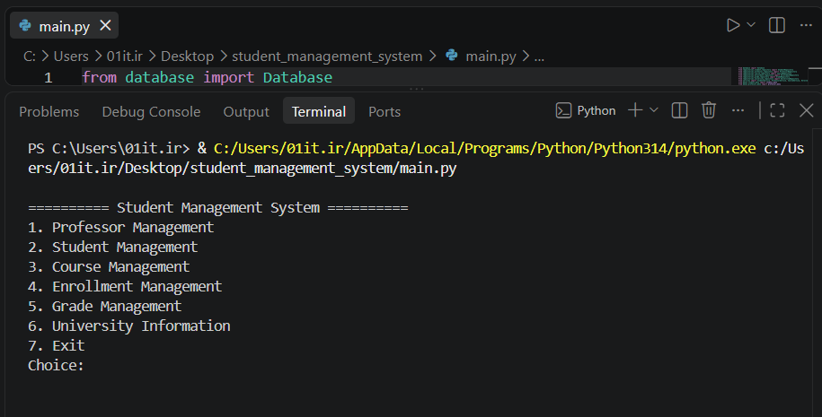
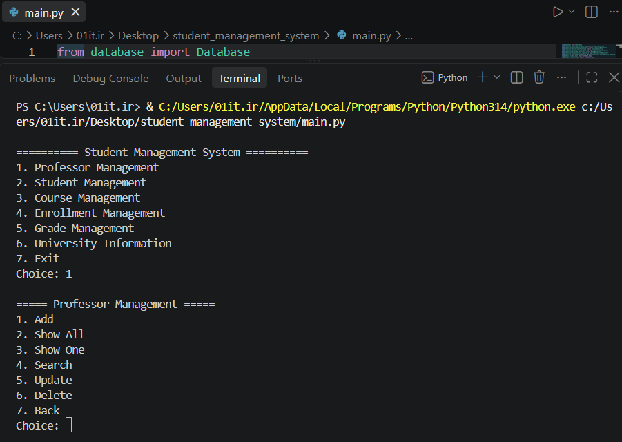
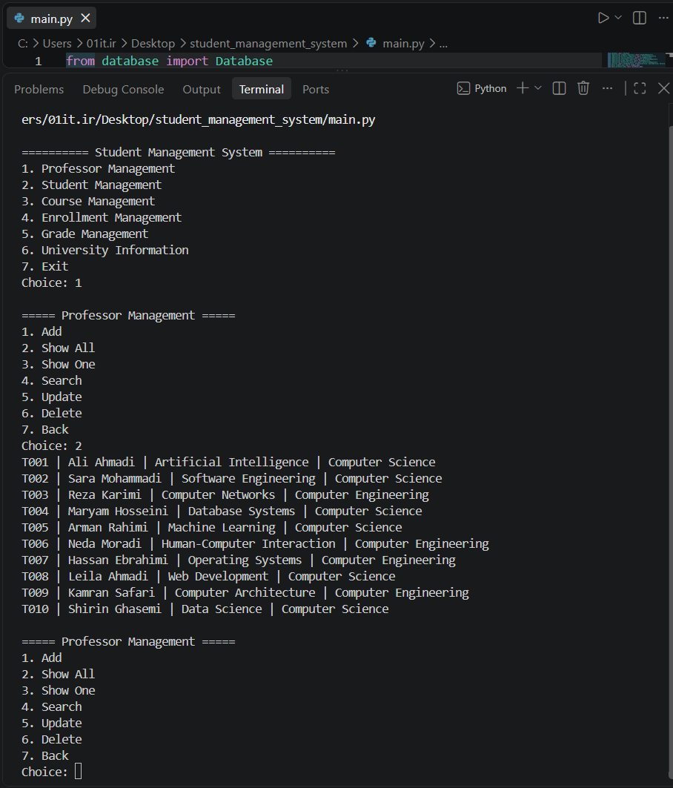
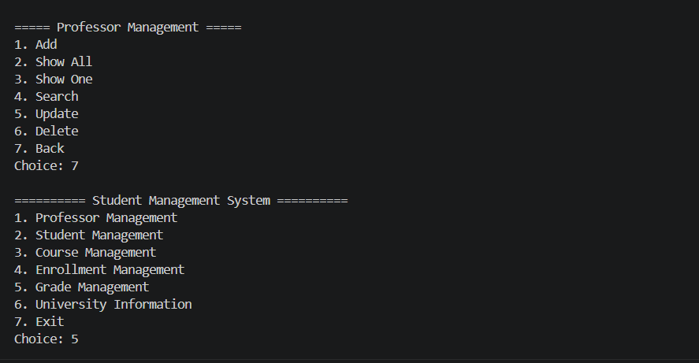
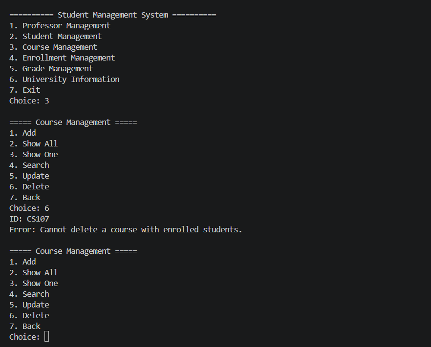

# Student Management System

A modular **Student Management System** built with Python, designed to demonstrate clean architecture, object-oriented programming, separation of concerns, data validation, SQLite persistence, custom exception handling, logging, and automated testing.

## Overview

This project is a command-line application for managing university-related entities such as students, professors, courses, enrollments, and grades.

The application follows a layered architecture to keep business logic, data access, validation, and user interaction separated.

## Architecture

```text
                    ┌───────────────┐
                    │   Menu / CLI  │
                    └───────┬───────┘
                            │
                            ▼
                    ┌───────────────┐
                    │    Service    │
                    └───────┬───────┘
                            │
              ┌─────────────┴─────────────┐
              │                           │
              ▼                           ▼
       ┌──────────────┐            ┌──────────────┐
       │  Validation  │            │  Exceptions  │
       └──────────────┘            └──────────────┘
                            │
                            ▼
                    ┌───────────────┐
                    │  Repository   │
                    └───────┬───────┘
                            │
                            ▼
                    ┌───────────────┐
                    │    SQLite     │
                    └───────────────┘
```

## Features

### Student Management

* Add students
* View students
* Search students
* Update student information
* Delete students

### Professor Management

* Add and manage professors
* Search and retrieve professor information
* Update and delete professors

### Course Management

* Create and manage courses
* Assign professors
* Manage course capacity

### Enrollment Management

* Enroll students in courses
* Prevent duplicate enrollments
* Check course capacity
* Validate student and course existence

### Grade Management

* Add and manage grades
* Validate grades within the `0..20` range
* Require a valid enrollment before assigning a grade

### Validation & Error Handling

* Email validation
* Numeric validation
* Required-field validation
* Custom exceptions
* Business-rule validation

### Database & Persistence

* SQLite database
* Automatic database creation
* Seed data on first run
* Repository-based data access

### Testing & Logging

* Automated tests with Pytest
* Application logging
* Separation between business logic and presentation

## Project Structure

```text
student_management_system/
│
├── data/
│   ├── courses_data.py
│   ├── enrollments_data.py
│   ├── grades_data.py
│   ├── professors_data.py
│   ├── students_data.py
│   └── university_data.py
│
├── database/
│   ├── database.py
│   └── seed.py
│
├── exceptions/
│   └── errors.py
│
├── menus/
│   ├── course_menu.py
│   ├── enrollment_menu.py
│   ├── grade_menu.py
│   ├── professor_menu.py
│   ├── student_menu.py
│   ├── university_menu.py
│   └── helpers.py
│
├── models/
│   ├── course.py
│   ├── enrollment.py
│   ├── grade.py
│   ├── professor.py
│   ├── student.py
│   └── university.py
│
├── repositories/
│   ├── course_repository.py
│   ├── enrollment_repository.py
│   ├── grade_repository.py
│   ├── professor_repository.py
│   ├── student_repository.py
│   └── university_repository.py
│
├── services/
│   ├── course_service.py
│   ├── enrollment_service.py
│   ├── grade_service.py
│   ├── professor_service.py
│   ├── student_service.py
│   └── university_service.py
│
├── tests/
│   └── test_services.py
│
├── utils/
│   └── logger.py
│
├── validators/
│   └── validators.py
│
├── screenshots/
│   ├── 1.png
│   ├── 2.png
│   ├── 3.png
│   ├── 4.png
│   └── 5.png
│
├── config.py
├── main.py
├── requirements.txt
└── README.md
```

## Technologies

* **Python**
* **SQLite**
* **Pytest**
* Object-Oriented Programming (OOP)
* Layered Architecture
* Repository Pattern
* Service Layer
* Input Validation
* Custom Exceptions
* Logging
* Git & GitHub

## Installation

Clone the repository and navigate to the project directory:

```bash
git clone https://github.com/asmamirzaei1990/student-manegment-system.git
cd student-manegment-system
```

Install the required dependencies:

```bash
pip install -r requirements.txt
```

## Run the Application

Start the application with:

```bash
python main.py
```

The SQLite database is created automatically in the project root.

## Run Tests

Run the test suite with:

```bash
pytest -q
```

## Reset Database

To reset the database:

```python
from database import Database

Database().reset()
```

Then run the application again:

```bash
python main.py
```

## Screenshots

### Main Application



### Student Management



### Application Interface



### Data Management



### Application Output



## Design Goals

The main goal of this project is to demonstrate practical software development concepts rather than simply implementing CRUD operations.

The project focuses on:

* Separation of concerns
* Maintainable code structure
* Reusable services and repositories
* Input and business-rule validation
* Persistent data storage
* Error handling
* Automated testing
* Clean project organization

## Project Status

The project is actively being developed and can be extended with additional features such as a graphical user interface, REST API, authentication, role-based access control, and advanced reporting.

## Author

**Asma Mirzaei**

Computer Science | Python | Software Development | UI/UX
